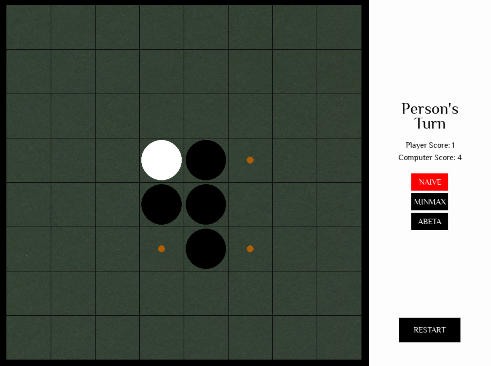

# Reverpy - Reversi game and bot written in python



## Why?

This is a project done for the undergraduate course "Introduction to Artificial Intelligence" in Wrocław University of Science and Technology. The task was to make a "bot" that could outsmart a human in the game of Reversi (alt. name: Othello).

## Game rules ([Source](https://www.mastersofgames.com/rules/reversi-othello-rules.htm))

Player's toss a coin to decide who will play first. Each turn, the player places one piece on the board with their colour facing up.

For the first four moves, the players must play to one of the four squares in the middle of the board and no pieces are captured or reversed.

Each piece played must be laid adjacent to an opponent's piece so that the opponent's piece or a row of opponent's pieces is flanked by the new piece and another piece of the player's colour. All of the opponent's pieces between these two pieces are 'captured' and turned over to match the player's colour.

It can happen that a piece is played so that pieces or rows of pieces in more than one direction are trapped between the new piece played and other pieces of the same colour. In this case, all the pieces in all viable directions are turned over.

The game is over when neither player has a legal move (i.e. a move that captures at least one opposing piece) or when the board is full.

## How to run

Just install the requirements (numpy and pygame) and run the game.py file!

```
pip3 install -r requirements.txt
python3 game.py
```

## Attribution
Font used: Philosopher-Regular (License is in the res folder)
